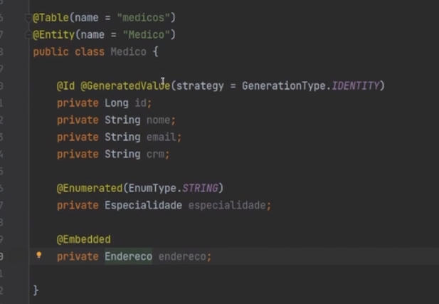
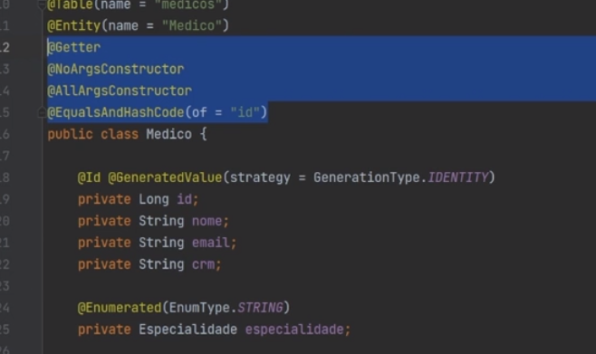
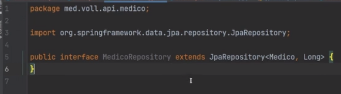
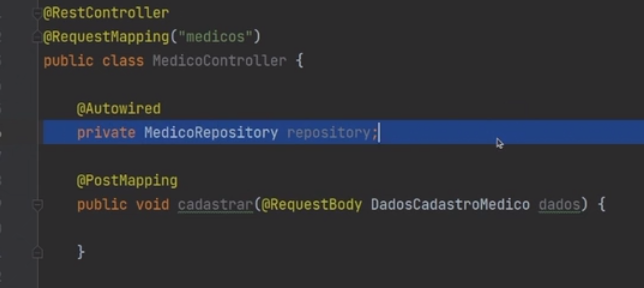

# API REST (básico)

## Elementos iniciais
### Web server


### Rest


### Configurar devTools para auto deploy


## POST


## Persistir no banco
1- Adicionar dependências que serão usadas:
- Validation (I/O): Bean validation
- MySQL Driver (SQL): Driver do MySQL
- Spring Data JPA: Cuida da persistência de dados no banco Java Persistence
- Flyway migration: Versionamento do banco

Com o Sprin Data JPA, é necessário configurar o banco de dados no ```aplication.properties```


DTO: Estrutura corresponde aos dados do Request Body de uma requisição, é análogo ao esqueleto do JSONObject que é enviado, no java podemos representá-lo através de uma classe Record, criando atributos correspondendo a cada campo passado no JSON.

JPA: Estrutura correspondente aos dados salvos no banco, é análogo à tabela e colunas, no java podemos representá-los através de uma classe 

a annotation `Embedded` indica que os atributos dessa classe estão presentes na mesma tabela de Médicos do MySQL, ela não representa uma tabela própria no banco, é apenas questão organizacional do código no java.

LOMBOK: Com essa dependência, temos acesso a uma série de annotations que facilitam criação de código dentro da classe JPA:

- Getter: cria todos os getters;
- NoArgsConstructor: cria um construtor sem parâmetros (demanda do JPA)
- AllArgsConstructor: crua um construtor com todos os parâmetros, para podermos instanciá-lo
- EqualsAndHashCode: Gerar equals e hashCode levando em conta o id;

### Repository
Spring Data JPA dispõe algumas ferramentas para persistir dados no banco,
- JpaRepositoy: Deve-se criar uma interface com suffixo _Repository_ e extende-la d`JpaRepository`. Usando dois generics, a entidade que ela irá representar e o atributo do PK (geralmente long)


Uma vez criada, usaremos essa interface para persistir os dados (nesse caso, relacionados aos médicos).
Podemos criar uma instância dessa interface na classe onde desejamos usar, mas como se trata de algo herdado do spring, podemos usar **injeção de dependencia**(Autowired) e o próprio spring vai trazer a instância dela:
