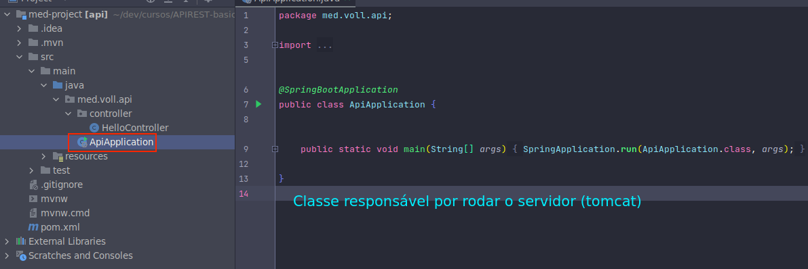

# API REST (básico)

## Elementos iniciais
### Web server


### Rest


### Configurar devTools para auto deploy


## POST


## Persistir no banco
1- Adicionar dependências que serão usadas:
- Validation (I/O): Bean validation
- MySQL Driver (SQL): Driver do MySQL
- Spring Data JPA: Cuida da persistência de dados no banco Java Persistence
- Flyway migration: Versionamento do banco

Com o Sprin Data JPA, é necessário configurar o banco de dados no ```aplication.properties```

